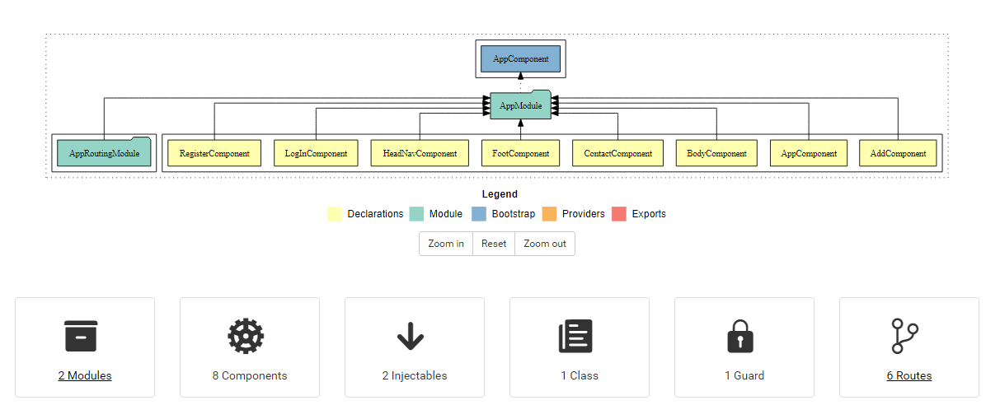
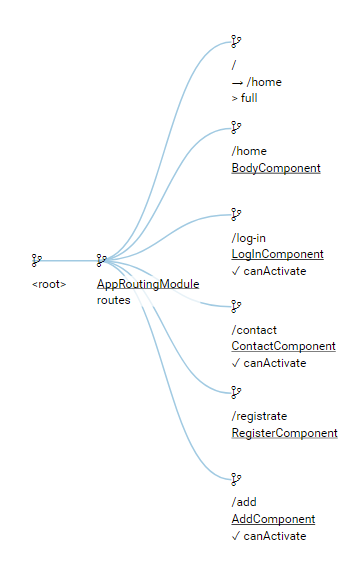

## [Web-Page Link](https://gicharkviani.github.io/B2B/)

# BTB

This project was generated with [Angular CLI](https://github.com/angular/angular-cli) version 11.2.11.

## Development server

Run `ng serve` for a dev server. Navigate to `http://localhost:4200/`. The app will automatically reload if you change any of the source files.

## Code scaffolding

Run `ng generate component component-name` to generate a new component. You can also use `ng generate directive|pipe|service|class|guard|interface|enum|module`.

## Build

Run `ng build` to build the project. The build artifacts will be stored in the `dist/` directory. Use the `--prod` flag for a production build.

## Running unit tests

Run `ng test` to execute the unit tests via [Karma](https://karma-runner.github.io).

## Running end-to-end tests

Run `ng e2e` to execute the end-to-end tests via [Protractor](http://www.protractortest.org/).

## Further help

To get more help on the Angular CLI use `ng help` or go check out the [Angular CLI Overview and Command Reference](https://angular.io/cli) page.

---
## Dependencies:
- @angular/animations : ~11.2.12
- @angular/cdk : ^11.2.13
- @angular/common : ~11.2.12
- @angular/compiler : ~11.2.12
- @angular/core : ~11.2.12
- @angular/fire : ^6.1.5
- @angular/forms : ~11.2.12
- @angular/localize : ~11.2.12
- @angular/material : ^11.2.13
- @angular/platform-browser : ~11.2.12
- @angular/platform-browser-dynamic : ~11.2.12
- @angular/router : ~11.2.12
- @ng-bootstrap/ng-bootstrap : ^9.1.3
- bootstrap : ^5.0.1
- jquery : ^3.6.0
- rxjs : ~6.6.0
- tslib : ^2.0.0
- zone.js : ~0.11.3
- firebase : ^7.0 || ^8.0

**For more Information, visit to this project's documentation.**
